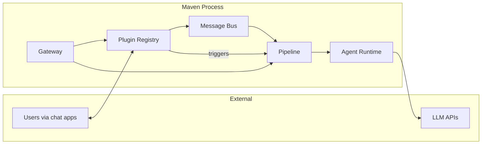
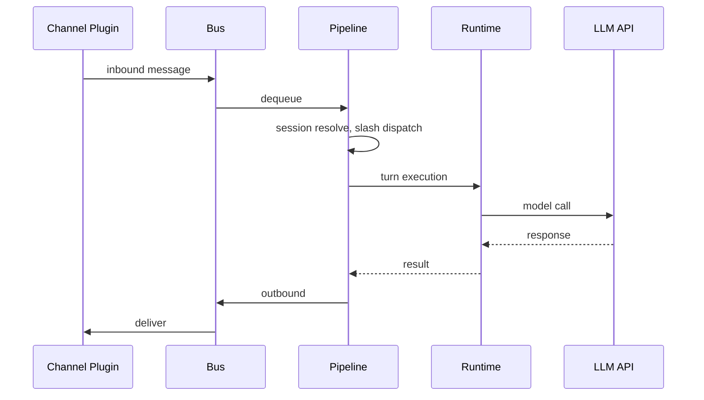

# Maven Architecture

Maven is a single-process Go application: CLI agent and persistent gateway for personal AI assistance. Chat transports, scheduled jobs, and health checks share one execution model built on `ageneral-agents-go`.

## Design constraints

1. **Single execution surface** — Chat, cron, and heartbeat all flow through the same pipeline and agent runtime.
2. **Single mutation path** — `Gateway.Apply` is the only way to change active system state.
3. **Kernel wall** — Core logic never imports plugins; composition happens in `internal/gateway/wire.go`.

## Topology

| Plane | Responsibility |
|-------|----------------|
| **Ingress** | Channels and triggers normalize inbound stimuli |
| **Execution** | Pipeline coordinates turns, sessions, tools, model calls |
| **Egress** | Bus dispatches outbound messages to channels |

## Kernel packages

All packages under `internal/kernel/` are plugin-agnostic core logic:

| Package | Role |
|---------|------|
| `internal/kernel/bus` | Inbound/outbound message routing |
| `internal/kernel/pipeline` | Turn coordinator; implements `TurnExecutor` |
| `internal/kernel/agent` | SDK runtime wrapper |
| `internal/kernel/session`, `internal/kernel/sessionid` | Session routing and persistence |
| `internal/kernel/scheduling` | Turn admission control |
| `internal/kernel/health` | Liveness signals |
| `internal/kernel/events` | Internal event bus |
| `internal/kernel/turnctx` | Per-turn context |
| `internal/kernel/executor` | `TurnExecutor` / `StreamRunner` contracts |
| `internal/kernel/stringutil`, `internal/kernel/log` | Shared utilities |
| `internal/kernel/memory` | Memory registry: fan-out reads, primary-only writes, prompt formatting |
| `internal/kernel/prompt` | Static system prompt template (AGENTS.md, SOUL.md) |
| `internal/kernel/slash`, `internal/kernel/slashkind` | Slash command registry and dispatch |
| `internal/kernel/config` | Config load, watch, hot reload |
| `internal/kernel/voice` | TTS/STT provider interfaces |
| `internal/kernel/channel` | Channel interface and manager |
| `internal/kernel/task` | Background task tooling |
| `internal/kernel/plugin` | Plugin axis interfaces and registry |

## Plugin axes

Defined in `internal/kernel/plugin/plugin.go`. Each axis is an optional interface on `Plugin`:

| Interface | Contributes |
|-----------|-------------|
| `ChannelPlugin` | Chat transports (`channels.Channel`) |
| `ToolPlugin` | Agent tools (`tool.Tool`) |
| `SkillPlugin` | Prompt-time skills (`api.SkillRegistration`) |
| `TTSPlugin` / `STTPlugin` | Voice providers |
| `SlashPlugin` | Pre-model `/commands` |
| `TriggerPlugin` | Background triggers (cron, heartbeat) |
| `MemoryPlugin` | Long-term memory read/write; exactly one primary plugin required |

The registry (`internal/kernel/plugin/registry.go`) collects contributions by axis at runtime.

## Plugin implementations

| Path | Axis |
|------|------|
| `internal/plugins/channel/telegram`, `feishu`, `wecom`, `whatsapp`, `matrix`, `web` | Channel |
| `internal/plugins/trigger/cron` | Trigger + Slash + Tool |
| `internal/plugins/trigger/heartbeat` | Trigger |
| `internal/plugins/trigger/memconsolidate` | Trigger (memory consolidation) |
| `internal/plugins/skill/file` | Skill |
| `internal/plugins/voice/cartesia`, `deepgram`, `elevenlabs`, `openai` | TTS/STT |
| `internal/plugins/tool/acp` | Tool |
| `internal/plugins/memory/file` | Memory (primary) + Tool (`remember`) |

## Gateway as plugin host

The gateway wires kernel subsystems and hosts all plugins:

| File | Responsibility |
|------|----------------|
| `internal/gateway/gateway.go` | `Gateway` struct, `Options`, `New` / `NewWithOptions` |
| `internal/gateway/apply.go` | Single mutation path: `Apply`, runtime rebuild, channel reload |
| `internal/gateway/lifecycle.go` | `Run`, `Shutdown`, signal handling, hot reload |
| `internal/gateway/wire.go` | Composition root: plugin manifest + `Wire()` entry point |
| `internal/gateway/triggers.go` | Trigger start/stop helpers |

### Apply loop

`Apply` is idempotent desired-state reconciliation:

1. Validate reload constraints (workspace immutability)
2. Stop background triggers
3. Load skills, build system prompt, register slash commands
4. Build fresh agent runtime from factory + plugin tools
5. Reload pipeline (swap runtime, re-apply channels)
6. Start triggers

`Run` calls `Apply` once at startup, then blocks on signals or config hot-reload (each reload re-enters `Apply`).

### Wire manifest pattern

**To see everything the binary does, read `wire.go`.** It is the single composition root:

- Instantiates every plugin (channels, cron, heartbeat, skills, voice, ACP)
- Registers them in `plugin.NewRegistry`
- Wires cross-plugin dependencies (e.g. web channel ↔ registry, cron ↔ pipeline)
- Exposes `Wire(cfg, logger)` as the production entry point

No other file should import `internal/plugins/…` for side-effect registration.

## Kernel wall

`internal/kernel/` must never import `github.com/ageneralai/maven/internal/plugins/…`. Enforced by:

- Architectural rule: plugins depend on kernel, not vice versa
- `depguard` linter rule `kernel_no_plugins` in `.golangci.yml`

Only `internal/gateway/wire.go` (and tests) cross the wall.

## Execution flow

Background triggers (`cron`, `heartbeat`) call the same `TurnExecutor` the pipeline implements — identical tool and model behavior regardless of entry point.

## Configuration

Single config file (`~/.maven/config.json`). Gateway hot-reload watches the file and re-applies via `Apply`. Workspace files under `agent.workspace` supply memory context and skills.

## CLI entry

`cmd/maven` loads config, calls `gateway.Wire`, and runs the gateway lifecycle. Tests inject custom `Options.RuntimeFactory` via `NewWithOptions`.
