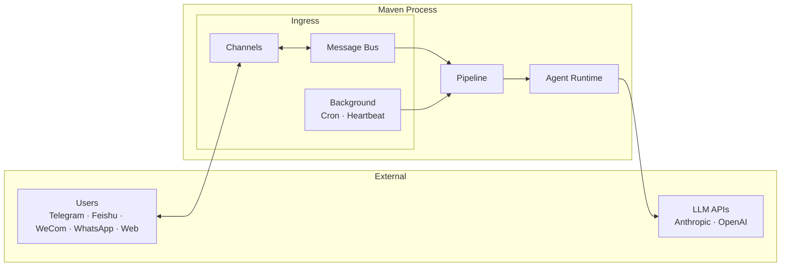
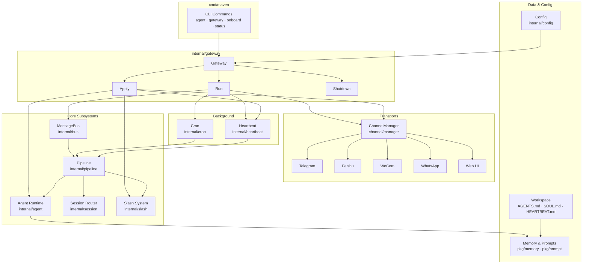
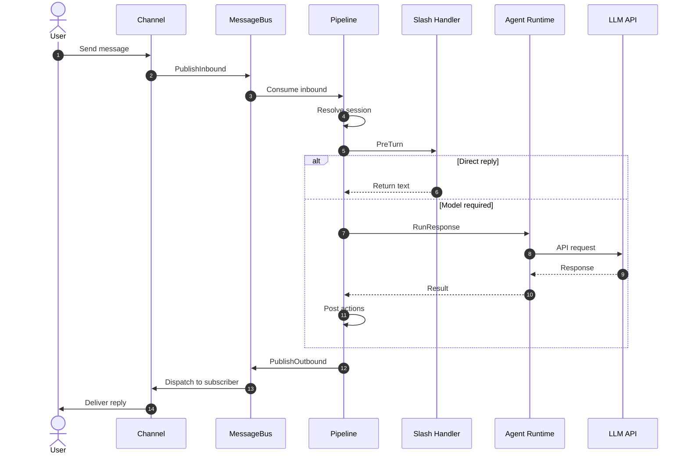
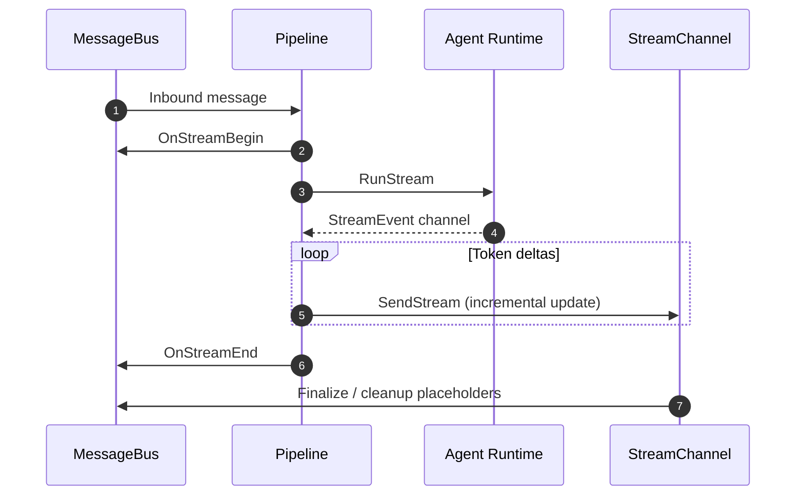
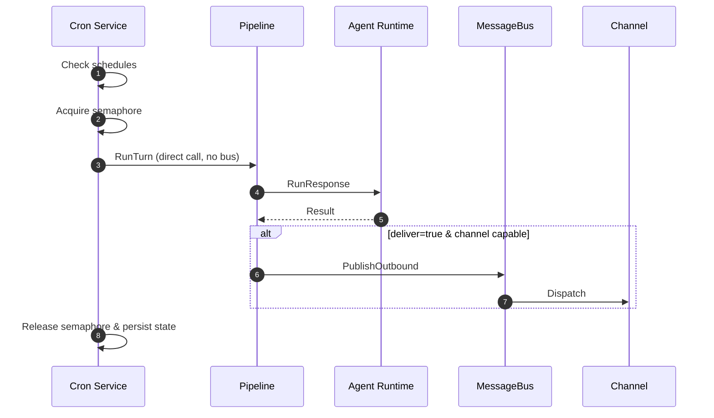

# Maven Architecture

## 1. Overview

Maven is a single-process Go application that serves as both a CLI agent and a persistent gateway service for personal AI assistance. It unifies multiple chat transports, scheduled background execution, and periodic health checks into a single coherent execution model built on top of `ageneral-agents-go`.

The system is designed around three core constraints:

1. **Single Execution Surface** — All work, whether initiated by chat, cron, or heartbeat, flows through the same pipeline and agent runtime.
2. **Single Configuration Path** — `Apply` is the sole mechanism for mutating system state; there are no ad-hoc reconfigurations.
3. **Explicit Boundaries** — The message bus handles transport decoupling, the pipeline handles execution coordination, and the runtime handles model interaction.

This document describes Maven's system architecture, execution model, major subsystems, and design rationale. It is intended for engineers navigating the implementation and should be read alongside the source code.

---

## 2. System Context

Maven operates as a single OS process that bridges users (via chat applications) and large language model (LLM) APIs. At runtime, the system can be decomposed into three logical planes:

| Plane | Responsibility |
|-------|---------------|
| **Ingress** | Normalization of inbound stimuli from chat channels and background triggers |
| **Execution** | Turn coordination, session routing, tool execution, and model invocation |
| **Egress** | Outbound message dispatch back to channels |

### 2.1 External Actors

- **Users** interact via Telegram, Feishu (Lark), WeCom, WhatsApp, or a built-in Web UI.
- **LLM Providers** (Anthropic, OpenAI) serve model inference via HTTP APIs.
- **System Administrator** provides configuration via `~/.maven/config.json` and workspace files under `~/.maven/workspace/`.

### 2.2 High-Level Topology



---

## 3. Core Architecture

### 3.1 Design Philosophy

Maven intentionally avoids distributed complexity. It is a single binary with a shared-nothing threading model (per-turn isolation) and explicit backpressure. Background systems do not introduce parallel execution stacks; they invoke the same `TurnExecutor` interface used by chat flows to guarantee identical behavior across all entry points.

### 3.2 The Unified Execution Abstraction

At the center of Maven is a single logical execution unit:

- **One Runtime** — An `ageneral-agents-go` SDK instance wrapped by `internal/agent`.
- **One Pipeline** — The `internal/pipeline` turn coordinator.
- **One Execution Contract** — The `TurnExecutor` interface (`pkg/executor`).

This abstraction ensures that a tool invoked from a Telegram message behaves identically to the same tool invoked from a cron job.

### 3.3 Component Map



---

## 4. Gateway Lifecycle

The Gateway (`internal/gateway`) owns process-level orchestration. It is the only component that constructs and swaps the agent runtime, manages channels, and coordinates shutdown.

### 4.1 Run

`Run` initializes and starts, in order:

1. Outbound dispatch loop (reads from `MessageBus.OutboundChan`)
2. Configuration application (`Apply`)
3. Channel manager startup
4. Cron scheduler startup
5. Heartbeat service startup
6. Inbound pipeline loop (reads from `MessageBus.InboundChan`)

`Run` blocks until shutdown or reload is triggered.

### 4.2 Apply

`Apply` is the **only** supported configuration mutation path. It performs an atomic reconfiguration:

1. Load and validate configuration (`internal/config`)
2. Build system prompt from workspace files (`AGENTS.md`, `SOUL.md`) and memory
3. Load skills (`internal/skills`)
4. Construct a new agent runtime (`internal/agent/sdk_runtime.go`)
5. Configure channels via the channel manager
6. Swap the runtime pointer into the pipeline under `turnMu` (write lock)
7. Refresh slash command handlers
8. Restart the heartbeat service

This guarantees that runtime, channels, and tools remain consistent. Partial failures during `Apply` do not leave the system in a mixed state because the runtime swap is atomic.

### 4.3 Shutdown

Shutdown is ordered and deterministic to prevent use-after-close and message loss:

1. Stop inbound processing (pipeline stops consuming)
2. Cancel active operations (context cancellation propagates to runtime)
3. Stop cron and heartbeat
4. Stop channels
5. Close runtime
6. Close message bus

### 4.4 Hot Reload

Hot reload is optional config watching (`internal/config/watch.go`) that triggers `Apply` on changes to `~/.maven/config.json`. A debounce window (default 800ms, configurable via `gateway.reloadDebounceMs`) prevents rapid successive reloads from causing thrash.

The reload sequence is:

1. **Config watcher detects change** — `fsnotify` observes a write, create, rename, or remove event on the config file.
2. **Debounce** — A timer resets on each event; only the trailing edge after the debounce period fires the reload.
3. **Gateway calls `Apply`** — This rebuilds the runtime, reconfigures channels, and refreshes slash handlers.
4. **Runtime swap under lock** — The pipeline holds `turnMu` (read lock) during active turns. `Apply` acquires the write lock, ensuring no turn is interrupted mid-flight.
5. **Drain and restart** — The channel manager stops old channels and starts new ones. The heartbeat service is restarted. Cron continues with its existing schedule (concurrency is fixed at startup).

Constraints:

* **Workspace path cannot change** during reload. If the config specifies a different `agent.workspace`, the reload is rejected and logged.
* **Cron concurrency** (`gateway.cron.maxConcurrentRuns`) is fixed at process start. Changing it requires a full restart.
* **No in-flight turns are dropped** — The write lock on `turnMu` waits for active turns to complete before swapping the runtime.

This design ensures that a running gateway can pick up model changes, channel reconfigurations, skill updates, and prompt edits without dropping connections or losing messages.

---

## 5. Message Bus

The message bus (`internal/bus`) is the central nervous system for chat-driven work. It provides strictly bounded, blocking queues for both inbound and outbound traffic.

### 5.1 Semantics

- **Backpressure, not dropping:** `PublishInbound` and `PublishOutbound` block until buffer space is available, the context is canceled, or the bus is closed. No messages are silently dropped.
- **At-most-one subscriber per channel:** Outbound dispatch routes to a single handler per channel name.
- **Panic containment:** Subscriber panics are recovered and logged; they do not crash the bus.

### 5.2 Streaming Lifecycle

For streaming-capable channels (e.g., Telegram private chats), the bus supports optional `StreamDelegate` hooks:

- `OnStreamBegin` — Called before `RunStream` consumes the runtime
- `OnStreamEnd` — Called after the stream completes or fails

### 5.3 Event Emission

The bus emits structured events via `pkg/events`:
- `EventBusPublishFailure` — Enqueue failures (with stream, channel, and error attributes)
- `EventBusClosed` — Emitted after queues are drained and closed

These integrate with the global event publisher for observability.

---

## 6. Pipeline

The pipeline (`internal/pipeline`) is the execution coordinator. It is the only component that directly invokes the agent runtime.

### 6.1 Responsibilities

- Consume inbound messages from the bus
- Resolve session routing (`channel:chatId → sessionId`)
- Execute slash pre-processing
- Invoke the runtime (streaming or synchronous)
- Apply post-turn actions
- Publish outbound messages

### 6.2 Concurrency Model

The runtime pointer is protected by `turnMu`:
- **Read lock** held during turn execution
- **Write lock** used only during `Apply` when swapping runtimes

This prevents runtime replacement while a turn is in flight.

### 6.3 Execution Paths

For every inbound message, the pipeline evaluates the following ordered paths:

1. **Built-in command** (e.g., `/new`) — Handled without model invocation
2. **Slash `PreTurn`** — May return a direct response or attach metadata
3. **Runtime execution**
   - `RunStream` for streaming channels
   - `RunResponse` otherwise
4. **Post actions** — Compaction, session rotation
5. **Outbound publish** — Results enqueued on the bus

---

## 7. Agent Runtime

The runtime (`internal/agent`) wraps `ageneral-agents-go` and presents a clean execution surface to the pipeline.

### 7.1 Construction

The runtime is constructed during `Apply` with:

- Provider configuration (Anthropic or OpenAI)
- System prompt (workspace + memory merged)
- Skill registrations
- MCP server definitions (optional)
- Auto-compact configuration
- Cron tools (`CronSchedule`, `CronList`, `CronRemove`)

### 7.2 Execution Surface

| Method | Use Case |
|--------|----------|
| `Run` | Synchronous non-streaming turn |
| `RunStream` | Streaming turn (token-by-token delivery) |

Both accept prompt text, multimodal content blocks, session ID, and optional metadata.

### 7.3 Tools

Cron tools are injected into the runtime so the agent can schedule future work. Slash commands are **not** part of the runtime; they execute in the pipeline layer to avoid model round-trips for administrative operations.

---

## 8. Session Management

Session routing (`internal/session`) provides stable conversation identity:

```
channel:chatId → sessionId
```

### 8.1 Properties

- **Stable:** A given chat route always maps to the same session ID across restarts (unless rotated)
- **Persisted:** Session state survives process restarts
- **Rotatable:** Explicitly rotated on `/new` or compaction triggers

### 8.2 Background Isolation

Background execution intentionally does **not** reuse chat sessions:

- **Cron** uses `cron.SessionKey` — stable session keys derived from job ID
- **Heartbeat** uses `heartbeat.SessionKey` — stable session keys per run

This prevents background tool execution from polluting user conversation history.

---

## 9. Slash System

Slash handling (`internal/slash`) runs before model execution in the pipeline. It provides:

- Command parsing and routing
- Pre-turn interception (direct responses without LLM cost)
- Metadata injection into the turn context
- Post-action signaling (e.g., "compact this conversation after the turn")

### 9.1 Post-Action System

Post-actions (`internal/agent/postaction.go`) execute after the runtime returns a response. The canonical example is **compaction**:

1. Generate a conversation summary
2. Rotate the session (new session ID)
3. Persist the summary as seed history for the new session

This ensures continuity without unbounded context growth.

---

## 10. Channels

Channels implement `internal/channel.Channel` and act as interchangeable transport adapters.

### 10.1 Responsibilities

- Normalize inbound messages to `bus.InboundMessage`
- Publish inbound work to the bus
- Deliver outbound messages from the bus
- Optional streaming support (`StreamChannel` interface)

### 10.2 Implementations

| Channel | Inbound | Outbound | Streaming | Notes |
|---------|---------|----------|-----------|-------|
| **Telegram** | Long polling | HTML + Bot API | Yes (private chats) | Supports reactions, file upload, media groups |
| **Feishu** | Webhook | Open API | No | Token-based auth; image download via tenant token |
| **WeCom** | Encrypted callback | `response_url` markdown | No | Reactive-only; no proactive delivery |
| **WhatsApp** | `whatsmeow` events | Text send | No | QR-code login; SQLite session store |
| **Web UI** | WebSocket | WebSocket | No | Responsive; gateway-hosted static files |

### 10.3 Reactive-Only Channels

WeCom is **reactive-only**: outbound `Send` depends on a cached `response_url` from a recent inbound message. Proactive cron delivery is explicitly skipped for these channels.

---

## 11. Background Execution

### 11.1 Cron

Cron (`internal/cron`) provides persistent scheduled execution backed by `jobs.json`.

**Features:**
- Persistent job store (JSON, atomic writes)
- Concurrency control via semaphore (`gateway.cron.maxConcurrentRuns`)
- Validation of job payloads before execution
- Optional delivery to chat channels

**Execution Model:**
- Each run uses a **new session** (no history accumulation)
- Delivery occurs only when `deliver=true` and the target channel supports proactive outbound

### 11.2 Heartbeat

Heartbeat (`internal/heartbeat`) runs periodic unattended checks.

**Behavior:**
- Reads `HEARTBEAT.md` from the workspace
- Skips if the file is empty or missing
- Single-flight execution (no overlapping runs)
- Uses a new session per run

**Special Handling:**
- Responses containing `HEARTBEAT_OK` are treated as no-op (no visible output)

---

## 12. Configuration

Configuration (`internal/config`) merges three layers:

1. **Defaults** — Hard-coded sensible defaults
2. **JSON file** — `~/.maven/config.json`
3. **Environment variables** — Override file values (e.g., `MAVEN_API_KEY`, `MAVEN_TELEGRAM_TOKEN`)

Validation enforces required fields for enabled components and cross-section consistency.

### 12.1 Hot Reload

When `gateway.hotReload` is enabled, `fsnotify` watches the config file. Changes trigger `Apply` after a debounce period (default 800ms). Immutable fields (workspace path, cron concurrency) require a full restart.

---

## 13. Observability

Maven includes a lightweight, structured observability layer.

### 13.1 Logging

Centralized via `pkg/log` (currently a `PrintLogger` stepping stone toward structured logging). Used across all subsystems.

### 13.2 Events (`pkg/events`)

- Structured event system with a global publisher
- Used by the bus and other components for lifecycle signals
- Event types: `EventBusPublishFailure`, `EventBusClosed`, and custom system signals

### 13.3 Health (`internal/health`)

- `HealthReporter` hooks provide coarse-grained liveness
- Consumed by the gateway and heartbeat services

Observability is intentionally minimal and extensible; the system avoids heavy metric dependencies.

---

## 14. Data and Workspace

The workspace directory (default `~/.maven/workspace`) provides:

| Path | Purpose |
|------|---------|
| `AGENTS.md` / `SOUL.md` | System prompt construction (persona + identity) |
| `HEARTBEAT.md` | Heartbeat runner task text |
| `memory/MEMORY.md` | Long-term memory |
| `memory/` (daily journals) | Daily memory entries |
| `skills/<name>/SKILL.md` | Custom skill definitions |
| `.telegram/slashes/` | Optional Telegram slash command definitions |

Prompt construction merges workspace files and memory context at runtime build time.

---

## 15. Data Flows

### 15.1 Chat Inbound → Outbound (Synchronous)



### 15.2 Streaming Turn



### 15.3 Background Execution (Cron)



---

## 16. Design Principles & Decisions

| Principle | Rationale |
|-----------|-----------|
| **Single execution surface** | Eliminates behavior drift between chat and background work |
| **Single configuration path** | `Apply` guarantees atomic, consistent state changes |
| **Explicit boundaries** | Bus, pipeline, and runtime are separate packages with narrow interfaces |
| **Background isolation** | Cron and heartbeat use dedicated sessions to prevent context pollution |
| **Explicit backpressure** | Blocking queues prevent silent message loss under load |
| **Channels as adapters** | New transports require only the `Channel` interface implementation |
| **Minimal observability** | Structured events and logging without heavy external dependencies |

---

## 17. Repository Structure

```
cmd/maven/              CLI entrypoints (agent, gateway, onboard, status, skills)
internal/
  gateway/              Process lifecycle orchestration
  pipeline/             Turn execution coordinator
  bus/                  Inbound/outbound messaging
  agent/                Runtime adapter and post-actions
  channel/              Channel interface, streaming helpers, base types
    manager/            Channel wiring (Apply / outbound subscribers)
    telegram/
    feishu/
    wecom/
    whatsapp/
    web/
  config/               Configuration loading, validation, and file watching
  cron/                 Scheduler, persistent job store, SessionKey, Deliver

  tools/
    cron/               CronSchedule / CronList / CronRemove SDK tools + slash helpers

  heartbeat/            HEARTBEAT.md periodic runner and tick SessionKey
  session/              Session ID routing and rotation
  slash/                Command parsing and pre-turn handling
  skills/               SKILL.md loader and SDK registration
  testutil/             Shared test helpers
pkg/
  context/              Per-turn metadata on context.Context
  events/               Structured event system
  executor/             TurnExecutor interface
  log/                  Centralized logging
  memory/               MEMORY.md and daily journal management
  prompt/               System prompt builder
  stringutil/           String helpers
docs/                   Setup guides and sample workspace
```

---

## 18. Operational Notes

- **Config file permissions:** `~/.maven/config.json` is created with `0600` (owner read/write only)
- **Workspace immutability:** Changing `agent.workspace` requires a process restart, not just hot reload
- **Cron concurrency:** Changing `gateway.cron.maxConcurrentRuns` requires a restart
- **WeCom limitations:** Outbound is reactive-only; cron delivery is skipped with a log line
- **Memory growth:** Auto-compaction is opt-in (`autoCompact.enabled`) and triggers at a configurable context threshold
