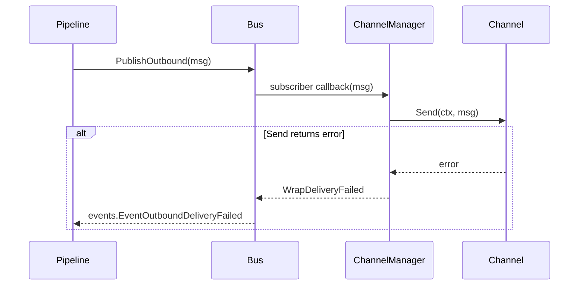

# Channels

A *channel* is a chat transport plugin. Each channel translates between its native protocol and Maven's internal `bus.InboundMessage` / `bus.OutboundMessage` types. All channels run inside the gateway process; you don't need a separate worker.

## Comparison

| Channel | Inbound | Outbound | Streaming | Files/images | Reactive only | Setup |
|---------|---------|----------|-----------|---------------|---------------|-------|
| **Telegram** | Long polling | Bot API | Yes (drafts + edits) | Photos, docs, voice, audio, video | No | [Setup →](telegram.md) |
| **Feishu (Lark)** | Webhook | Lark API | No | Images | No | [Setup →](feishu.md) |
| **WeCom** | Webhook | `response_url` | No | Images, voice | **Yes** | [Setup →](wecom.md) |
| **Matrix** | `/sync` | `m.room.message` | No | Text only | No | [Setup →](matrix.md) |
| **WhatsApp** | WebSocket | whatsmeow | No | Images | No | [Setup →](whatsapp.md) |
| **Web UI** | WebSocket | WebSocket | Yes | — (browser file uploads not implemented) | No | [Setup →](web.md) |

**Reactive only** means a channel can only reply within a short-lived response window opened by the user's last inbound. Cron jobs with `deliver: true` skip reactive-only channels with a logged warning — pick a different channel for proactive delivery.

## Capability model

```go
type CapabilitySet struct {
    Reactions    bool
    FileUpload   bool
    ReactiveOnly bool
}
```

The gateway uses these to decide whether to attempt certain operations (e.g. Telegram reactions for inbound feedback, WeCom cron-delivery skip).

## Allowlists

Every channel supports an `allowFrom` list. Empty (or omitted) means "allow all". Non-empty restricts inbound by sender identity. The identifier format varies:

- **Telegram** — numeric user ID (`"123456789"`).
- **Feishu** — `open_id` (`"ou_…"`).
- **WeCom** — `userid` configured in WeCom console (`"zhangsan"`).
- **Matrix** — MXID (`"@alice:example.org"`). Plus `allowRooms` for room IDs (`"!roomid:example.org"`).
- **WhatsApp** — JID (`"8613800138000@s.whatsapp.net"`); the matcher tries both raw and `:device-suffix`-stripped variants.
- **Web UI** — internal `web-<n>` ids (rarely useful; usually disable via auth).

## Outbound delivery

Outbound messages reach a channel through the bus:



The `ChannelManager.Apply` flow stops removed channels, starts new ones, and re-registers per-channel outbound subscribers. Hot reload re-runs this same path.

## Streaming channels

A channel that implements `channels.StreamChannel` opts into token streaming. The pipeline routes `SendStream` to it directly with the runtime's event channel. See [Concepts: Streaming](../concepts/streaming.md).

## Adding a new channel

1. Create `internal/plugins/channel/<name>/`.
2. Implement `channels.Channel` (and optionally `StreamChannel`, `InboundPreprocessor`).
3. Implement `plugin.ChannelPlugin` (`Name`, `Start`, `Stop`, `Channels(cfg)`).
4. Add a config struct under `config.ChannelsConfig` and validate it in `Validate()`.
5. Register the plugin in `internal/gateway/wire.go`.

The kernel never imports your package. Composition is the gateway's job.
