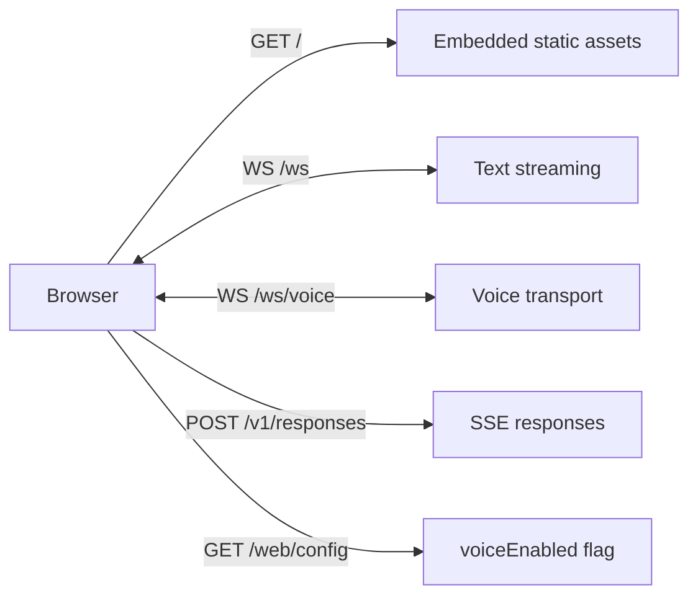

# Web UI

The Web UI is a single-page chat surface served by the gateway on the same port (`gateway.port`, default `18790`). It uses WebSocket for streaming, plus optional realtime voice on `/ws/voice`, plus an OpenAI-Responses-compatible `/v1/responses` HTTP endpoint.



## Enable

```json
{
  "channels": {
    "web": {
      "enabled": true,
      "allowFrom": [],
      "voice": {
        "enabled": false
      }
    }
  },
  "gateway": {
    "host": "0.0.0.0",
    "port": 18790
  }
}
```

| Field | Default | Description |
|-------|---------|-------------|
| `channels.web.enabled` | `false` | Master toggle. Shares the gateway HTTP listener. |
| `channels.web.allowFrom` | `[]` | Allowed internal `web-<n>` IDs. Generally not useful in practice. |
| `channels.web.voice.enabled` | `false` | Enable browser voice. See [Guides: Voice](../guides/voice.md). |

Open `http://localhost:18790` (or your gateway host/port) in a browser.

## Endpoints

| Path | Method | Purpose |
|------|--------|---------|
| `/` | GET | Embedded static SPA. |
| `/web/config` | GET | JSON `{ "voiceEnabled": bool }`. |
| `/ws` | WS | Text chat — JSON frames in both directions. |
| `/ws/voice` | WS | Realtime voice (binary PCM both ways + small JSON messages). Only when voice enabled. |
| `/v1/responses` | POST | OpenAI Responses-compatible SSE endpoint. |

Static assets are embedded via `//go:embed` so the binary is self-contained.

## `/ws` text framing

Client sends:

```json
{ "type": "message", "content": "hello" }
```

Server streams back (with the streaming pipeline):

```json
{ "type": "stream", "delta": "Hel" }
{ "type": "stream", "delta": "lo." }
{ "type": "stream_done" }
```

Single-shot fallback (when streaming is off):

```json
{ "type": "message", "content": "Hello." }
```

The server's `writeToClient` resolves the WebSocket connection by `clientID` (`web-<n>`). If the `chatID` doesn't match an open connection, it broadcasts to every connected client — useful for tests but not a feature you should rely on.

## `/v1/responses`

A subset of OpenAI's Responses API. Implementation: `internal/plugins/channel/web/responses`.

Request:

```http
POST /v1/responses HTTP/1.1
Content-Type: application/json
Maven-Session-Id: 550e8400-e29b-41d4-a716-446655440000

{
  "input": "Say hi",
  "previous_response_id": ""
}
```

Response (SSE):

```text
event: response.created
data: {"type":"response.created","response":{"id":"resp_…","status":"in_progress"}}

event: response.output_item.added
data: {"type":"response.output_item.added","index":0,"item":{"type":"message","status":"in_progress"}}

event: response.content_part.added
data: {"type":"response.content_part.added","item_index":0,"content_index":0}

event: response.output_text.delta
data: {"type":"response.output_text.delta","item_index":0,"content_index":0,"delta":"Hi"}

event: response.output_text.done
data: {"type":"response.output_text.done","item_index":0,"content_index":0}

event: response.content_part.done
data: …

event: response.output_item.done
data: …

event: response.completed
data: {"type":"response.completed","response":{"id":"resp_…","status":"completed"}}

data: [DONE]
```

| Header / field | Purpose |
|----------------|---------|
| `Maven-Session-Id` | Required for new conversations. UUID; the gateway maps it via `wsession.ResolveMavenSessionID` to a `web-<uuid>` session ID. |
| `previous_response_id` | When non-empty, must be a previously issued `resp_…`. Used to thread the next call into the same session — replaces the header for follow-ups. |
| `input` | Either a string or an array of `{type:"message", role:"user", content:"…"}`. The last user message wins. |

Errors: standard OpenAI shape:

```json
{ "error": { "message": "unknown previous_response_id", "type": "invalid_request_error" } }
```

## Session resolution

`web-<uuid>` is the SDK session ID for the Web UI. Different browsers / tabs get different UUIDs. The mapping from `previous_response_id` to session ID is kept in memory (`wsession.ResponseSessions`, TTL 30 minutes, max 500 entries) so follow-up calls thread into the right history without sending the session header again.

## Streaming through the gateway

The Web plugin holds a reference to the pipeline's `StreamRunner` (wired in `wire.go` via `webPlug.SetStreamRunner(pipe)`). When a `/ws` message arrives, it publishes to the bus like any other channel — but it also implements `channels.StreamChannel`, so the pipeline streams events to `SendStream` which encodes them as JSON frames.

## Disabling

Set `channels.web.enabled = false`. The endpoints disappear; `/` returns 404 from the gateway. The Web channel does not bind its own port — the gateway's HTTP server hosts it.
