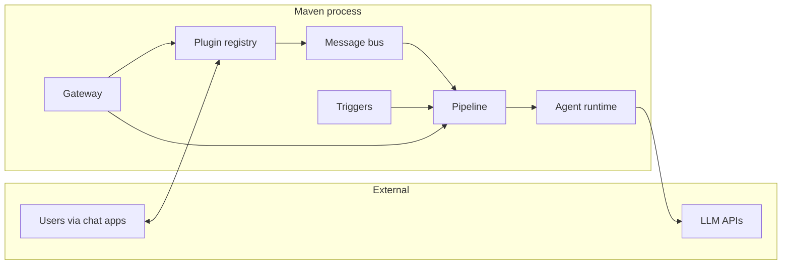
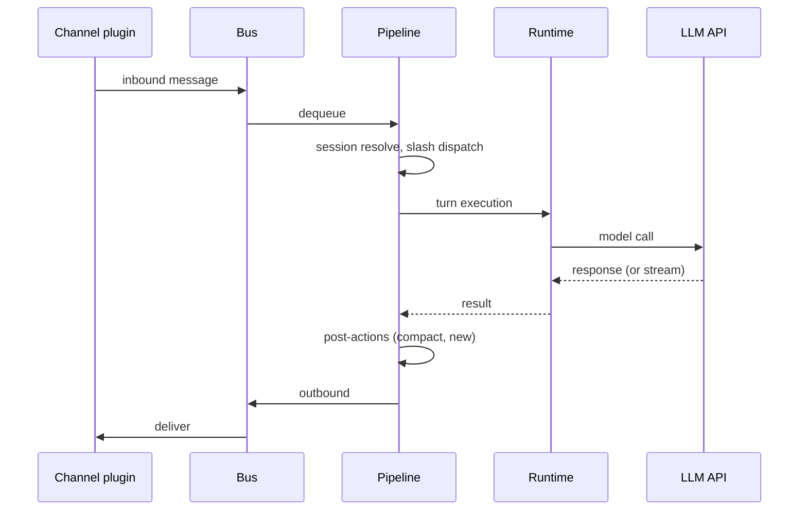

# Architecture

Maven is a single-process Go application. The CLI agent and the persistent gateway share one execution model. Chat transports, scheduled jobs, and health checks all flow through the same pipeline and agent runtime.

## Design constraints

1. **Single execution surface.** Chat, cron, heartbeat, and memory consolidation all invoke the same `TurnExecutor`.
2. **Single mutation path.** `Gateway.Apply` is the only way to change active system state. It is idempotent reconciliation, not imperative setup.
3. **Kernel wall.** Core logic in `internal/kernel/` never imports `internal/plugins/`. Composition happens exactly once, in `internal/gateway/wire.go`.

## Topology

| Plane | Responsibility |
|-------|----------------|
| **Ingress** | Channels and triggers normalize inbound stimuli into either a `bus.InboundMessage` or a direct `TurnExecutor.RunTurn` call. |
| **Execution** | Pipeline coordinates one turn: session resolve, slash dispatch, model call, post-actions, outbound publish. |
| **Egress** | Bus dispatches outbound to channels via per-channel subscribers; streaming uses the optional `StreamDelegate`. |

## Kernel packages

All packages under `internal/kernel/` are plugin-agnostic.

| Package | Role |
|---------|------|
| `kernel/bus` | Inbound/outbound message routing and stream lifecycle hooks. |
| `kernel/pipeline` | Turn coordinator; implements `executor.TurnExecutor` and `executor.StreamRunner`. |
| `kernel/agent` | SDK runtime wrapper around `ageneral-agents-go`. |
| `kernel/session`, `kernel/sessionid` | Session router (channel+chat → SDK session ID) and typed session IDs. |
| `kernel/scheduling` | Weighted-semaphore admission lane for triggers. |
| `kernel/health` | Liveness pulses (gateway ready, heartbeat tick, delivery failed). |
| `kernel/events` | Internal event publisher for diagnostics. |
| `kernel/turnctx` | Per-turn `context.Context` snapshot (channel, chat, metadata). |
| `kernel/executor` | `TurnExecutor` and `StreamRunner` contracts. |
| `kernel/memory` | Memory registry: fan-out reads, prompt formatting. |
| `kernel/prompt` | Static system prompt template (`AGENTS.md`, `SOUL.md`). |
| `kernel/slash`, `kernel/slashkind` | Slash command registry, parser, and dispatch. |
| `kernel/config` | Config load, validate, hot-reload watch. |
| `kernel/voice` | TTS/STT interfaces and session coordinator. |
| `kernel/channel` | Channel and channel-manager interfaces. |
| `kernel/task` | In-process `Task` tool plumbing. |
| `kernel/plugin` | Plugin axis interfaces and registry. |
| `kernel/httpc`, `kernel/log`, `kernel/stringutil` | Shared utilities. |

## Plugin axes

Each plugin implements `plugin.Plugin` plus zero or more axis interfaces. The registry aggregates contributions by axis at runtime.

| Interface | Contribution |
|-----------|--------------|
| `ChannelPlugin` | Chat transports (`channels.Channel`). |
| `ToolPlugin` | Agent tools (`tool.Tool`). |
| `SkillPlugin` | Prompt-time skills (`api.SkillRegistration`). |
| `TTSPlugin` / `STTPlugin` | Voice providers. |
| `SlashPlugin` | Pre-model `/commands`. |
| `TriggerPlugin` | Background triggers (cron, heartbeat, consolidation). |
| `MemoryPlugin` | Long-term memory read; exactly one primary writes. |

See [Concepts: Plugins](plugins.md) for the full registry contract.

## Plugin implementations

| Path | Axes |
|------|------|
| `plugins/channel/telegram`, `feishu`, `wecom`, `whatsapp`, `matrix`, `web` | Channel |
| `plugins/trigger/cron` | Trigger + Tool + Slash |
| `plugins/trigger/heartbeat` | Trigger |
| `plugins/trigger/memconsolidate` | Trigger |
| `plugins/skill/file` | Skill |
| `plugins/voice/{cartesia,deepgram,elevenlabs,openai}` | TTS/STT |
| `plugins/tool/acp` | Tool |
| `plugins/memory/file` | Memory (primary) + Tool (`remember`, `memory_search`, `memory_get`) |

## Gateway as plugin host

The gateway wires kernel subsystems and hosts all plugins:

| File | Responsibility |
|------|----------------|
| `gateway/gateway.go` | `Gateway` struct, `Options`, `New` / `NewWithOptions`. |
| `gateway/apply.go` | Single mutation path: `Apply`, runtime rebuild, channel reload. |
| `gateway/lifecycle.go` | `Run`, `Shutdown`, signal handling, hot reload. |
| `gateway/wire.go` | Composition root: plugin manifest + `Wire()` entry point. |
| `gateway/triggers.go` | Trigger start/stop helpers. |

### The Apply loop

`Apply` is idempotent desired-state reconciliation:

1. Validate reload constraints (`agent.workspace` immutable across reload).
2. Stop background triggers.
3. Ensure cron service exists; load skills; build system prompt; register slash commands.
4. Build a fresh agent runtime via the configured factory + plugin-contributed tools.
5. Reload pipeline (swap runtime under write lock, re-apply channels).
6. Restart triggers.

`Run` calls `Apply` once at startup, then blocks on signals or config hot-reload (each reload re-enters `Apply`).

### The wire manifest

`internal/gateway/wire.go` is the single composition root. To see everything the binary does, read that file. It:

- Instantiates every plugin (channels, cron, heartbeat, skills, voice, ACP, memory).
- Registers them in `plugin.NewRegistry`.
- Wires cross-plugin dependencies (e.g. Web channel ↔ registry, cron ↔ pipeline).
- Exposes `Wire(cfg, logger)` as the production entry point.

No other file should import `internal/plugins/…` for side-effect registration.

## Kernel wall

`internal/kernel/` must never import `github.com/ageneralai/maven/internal/plugins/…`. Enforced by:

- Architectural rule: plugins depend on kernel, never the reverse.
- `depguard` linter rule `kernel_no_plugins` in `.golangci.yml`.

Only `internal/gateway/wire.go` (and tests) cross the wall.

## End-to-end flow

Triggers (cron, heartbeat, mem-consolidate) call the same `TurnExecutor` the pipeline implements — identical tool, memory, and model behavior regardless of entry point.

## Configuration

Single config file (`~/.maven/config.json`). Gateway hot-reload watches the file via `fsnotify` and re-applies via `Apply` after a debounce. Workspace files under `agent.workspace` supply persona, memory, skills, and Telegram slash definitions.

See [Reference: Configuration](../reference/configuration.md) for the full schema and [Guides: Hot reload](../guides/hot-reload.md) for reload semantics.

## CLI entry

`cmd/maven` loads config, calls `gateway.Wire`, and runs the gateway lifecycle. Tests inject custom `Options.RuntimeFactory` via `NewWithOptions`.
