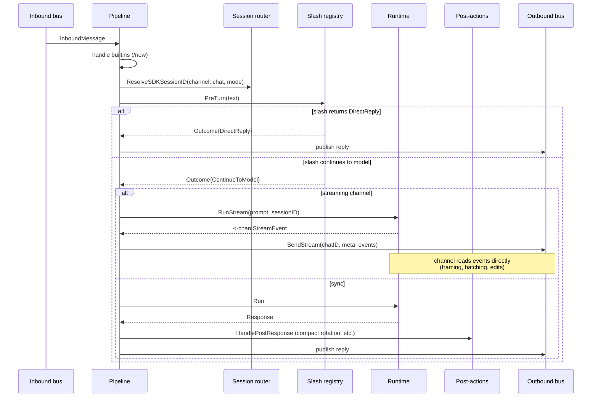

# Pipeline

The pipeline (`internal/kernel/pipeline`) is the single turn coordinator. Every inbound message from any channel, every cron job, and every heartbeat tick goes through it. There is no shortcut path.

## Contract

The pipeline implements two narrow interfaces from `kernel/executor`:

```go
type TurnExecutor interface {
    RunTurn(ctx context.Context, prompt, sessionID string) (string, error)
}

type StreamRunner interface {
    RunStream(ctx context.Context, prompt, sessionID string) (<-chan api.StreamEvent, error)
}
```

Triggers (cron, heartbeat, memory consolidation) receive a `TurnExecutor` and never see the underlying SDK runtime. Channels that support streaming receive a `StreamRunner` indirectly via the channel manager.

## Turn lifecycle



## Builtin commands

Before classification, the pipeline asks the post-action handler if the inbound carries a built-in command in its routing hints. Today the only built-in is **`/new`**, which rotates the chat's session and replies "Started a fresh session." without invoking the model.

Builtins bypass slash parsing entirely. Channels emit them via `bus.RoutingHints.BuiltinCommand`.

## Classification

`classifyTurn` produces a small plan from the inbound message and its channel:

| Field | Meaning |
|-------|---------|
| `useStream` | True when the channel implements `channels.StreamChannel` **and** `Hints.ForceSync` is false. |
| `slashName` | Routing hint set by channels that parsed `/` themselves (Telegram slash defs). |
| `sessionMode` | `current` (default) or `isolated`. |

Hints come from the channel plugin via `bus.RoutingHints` (e.g. Telegram channel sets `SlashCommand`, `SlashArgs`, `MessageID`, `ForceSync` for slash flows).

## Session resolution

The pipeline resolves an agentsdk session ID for every turn through `session.SessionResolver`:

- `SessionModeCurrent` (default): look up the persistent rotated session for the chat in the router; fall back to `chatSessionID(channel, chat)`.
- `SessionModeIsolated`: derive a one-shot id by wrapping the chat session ID with `sessionid.New(KindIsolated, base)`.

See [Concepts: Sessions](sessions.md) for the full session model and ID grammar.

## Slash dispatch

`slash.PreTurn` parses leading `/command` tokens (the lexer matches `agentsdk-go/pkg/runtime/commands`). Built-in commands (`compact`) and plugin commands (`cron-add`, `cron-list`, `cron-remove`) live in one registry. A non-empty `Result.Output` short-circuits the model and replies directly. An empty `Output` lets the model run while preserving `Result.Metadata` and `Result.PostAction`.

See [Guides: Slash commands](../guides/slash-commands.md).

## Runtime invocation

The pipeline holds the SDK runtime behind an `RWLock`:

- `RunTurn` / `RunStream` take a read lock for the entire turn.
- `Reload` takes a write lock, swaps the runtime pointer, then closes the old runtime — channels are re-applied **before** the swap so reconfiguration never stalls inbound on channel I/O.
- `TakeRuntimeForShutdown` clears the pointer under write lock for the shutdown drain.

Multimodal prompts: when an inbound has `ContentBlocks`, the pipeline prepends the text prompt as a text block and clears the string prompt. The SDK sees a uniform multimodal request.

## Streaming

If a channel implements `StreamChannel` and the message does not force sync, the pipeline:

1. Calls `bus.OnStreamBegin(streamHints)`.
2. Invokes `RunStream` and hands the event channel to `channel.SendStream`.
3. Calls `bus.OnStreamEnd(streamHints, err)`.

Channel implementations buffer or edit messages as they like (Telegram uses `sendMessageDraft` for private chats and `editMessageText` for groups; Web uses WebSocket frames). See [Concepts: Streaming](streaming.md).

## Post-actions

After a sync run, `postaction.Handler.HandlePostResponse` inspects the slash execution trail:

- **`CompactRotateAction`** (from built-in `/compact`): flush hook fires on the current session, the router rotates the session, the model's compact summary is seeded into the new session's history file, and the reply is either the summary or a fixed ack ("Conversation compacted and continued in a fresh session.").

Plugins can introduce new post-action types by returning them from slash handlers; the handler picks the first non-nil `PostAction` from the slash trail.

## Errors and user replies

Pipeline errors map to user-visible strings:

- Slash parse / handler error → `"Sorry, I encountered an error processing your command."`
- Runtime or post-action failure → `"Sorry, I encountered an error processing your message."`

Streaming errors that aren't `context.Canceled`/`DeadlineExceeded` emit `events.EventStreamFailed` and pulse `health.SignalDeliveryFailed`, then fall back to the same sync error reply.

## Reload semantics

The pipeline's `Reload` is the only safe way to swap the runtime in a live gateway:

```go
func (p *Pipeline) Reload(applyChannels func() error, newRt agent.Runtime, workspace string, slashReg *slash.Registry) error
```

`apply.go` calls it after building the new runtime. Channels reload **first** (no `turnMu` held), then the runtime swap happens under the write lock, then the old runtime is closed outside the lock. A failed `applyChannels` causes the gateway to close the orphan `newRt`.

## Concurrency model

- Inbound chat handling: one goroutine per dequeued message, runs under `turnMu.RLock`.
- Cron: per-job goroutine inside `cron.Service`, admitted through a weighted semaphore (`gateway.cron.maxConcurrentRuns`, default 1).
- Heartbeat: one ticker goroutine, try-once weight-1 semaphore — overlapping ticks log "previous tick still running" and skip.
- Memory consolidation: same pattern as heartbeat.

Channels can run concurrently with cron and heartbeat; they share the runtime, not the admission lanes.
