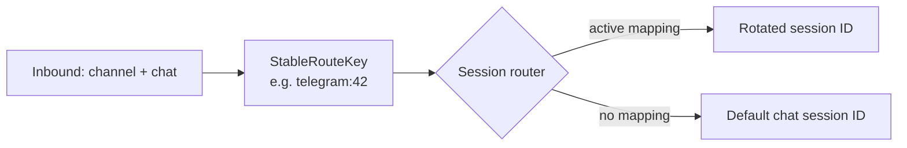

# Sessions

A *session* is the agentsdk identifier that scopes conversation history. Maven manages two artifacts per session:

- The **agentsdk session ID** — a string passed to the runtime so the SDK loads the right history file.
- The **stable route key** — a `channel:chat` identifier the gateway uses to map a real-world chat to whichever session is current for it.

The router (`internal/kernel/session.Router`) is the bridge.

## Session ID grammar

Defined in `internal/kernel/sessionid`.

| Kind | Format | When |
|------|--------|------|
| `chat` | `telegram-12345`, `web-uuid`, … | Default for an active chat; the route key's natural session. |
| `rotated` | `telegram-12345:rotated:1740000000000000000` | After `/new` or `/compact` rotation. |
| `isolated` | `telegram-12345:isolated:1740000000000000000` | `SessionModeIsolated` (Telegram slash defs that set `session: isolated`). |
| `cron` | `cron:{jobID}:{uuid}` | Each cron job run gets a fresh ID; jobs do not share history. |
| `heartbeat` | `heartbeat:{uuid}` | Each heartbeat tick gets a fresh ID. |
| `task` | `task:{uuid}` | In-process subagent run via the `Task` tool. |

Parsing back is symmetric: `sessionid.Parse("cron:job-1:abc-uuid")` returns `{Kind: cron, Owner: "job-1", Token: "abc-uuid"}`.

## Stable route key

`bus.InboundMessage.StableRouteKey()` returns `"{Channel}:{ChatID}"`. This is **not** a session ID — it's the routing key the router uses to look up which session ID is current.



## Resolution

`SessionResolver.ResolveSDKSessionID(channel, chat, routeKey, mode)`:

| `mode` | Result |
|--------|--------|
| `current` | Router lookup; falls back to `sessionid.ChatSessionID(channel, chat)`. |
| `isolated` | `sessionid.New(KindIsolated, chatSessionID).String()` — never persisted to the router. |

`current` is the default for chat inbound; `isolated` is opt-in per Telegram slash command via the `session: isolated` frontmatter.

## Rotation

Two flows rotate a chat's session:

- **`/new` builtin.** Channels emit `bus.RoutingHints.BuiltinCommand = "new"`. The pipeline calls `Router.Rotate(routeKey)`, replies "Started a fresh session.", and never invokes the model.
- **`/compact` slash command.** The model produces a continuation summary, the pre-compact flush hook fires (`remember` important context), then the router rotates and the new session's history is seeded with the summary as a system message.

Both produce `rotated:` session IDs. The router persists mappings to `<workspace>/.maven/session-router.json`.

## Persistence layout

```text
~/.maven/
  config.json                 # app config
  sessions/                   # agentsdk per-session history JSONL
    telegram-42.jsonl
    telegram-42:rotated:1740…000.jsonl
  workspace/
    .maven/
      session-router.json     # routeKey → current session ID
      history/                # compact seed files keyed by sessionID
```

The agentsdk's `SessionStore` (a `session.Store` writing JSONL under `~/.maven/sessions`) holds turn-by-turn message history. The router stores **which** session ID a chat currently uses.

## Trigger isolation

Triggers do not use the router:

- **Cron** generates a fresh `cron:{jobID}:{uuid}` per run. Two runs of the same job never share history.
- **Heartbeat** generates a fresh `heartbeat:{uuid}` per tick.
- **Memory consolidation** uses `isolated:mem-consolidate:{nanos}`.

This isolation is deliberate: backgrounds should not contaminate the user's chat history (and vice-versa).

## Task subagents

The in-process `Task` tool derives `task:{uuid}` for each invocation. Nested task delegation is rejected — the tool inspects the parent session ID via `turnctx` metadata and refuses to run if it is already a `task:` session.

See [Guides: Subagents](../guides/subagents.md).

## Web UI sessions

The Web UI generates a UUID per browser session and includes it as the `Maven-Session-Id` header (or `?session=` query param for the voice WebSocket). The `wsession.ResolveMavenSessionID` resolver:

- Accepts a `Maven-Session-Id` header for new conversations.
- Accepts a `previous_response_id` body field for `/v1/responses` follow-ups and binds it back to its prior session ID.
- Errors with `invalid previous_response_id` for unknown or malformed IDs.
