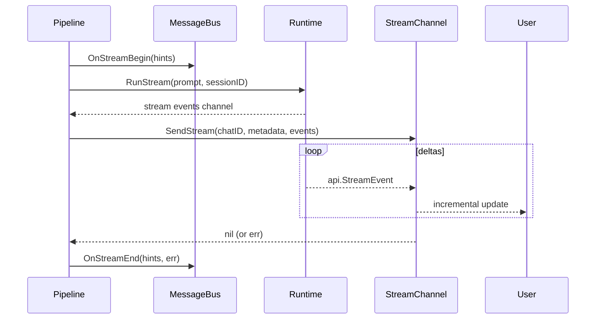

# Streaming

Maven supports token-by-token streaming when both the LLM provider returns chunks **and** the destination channel implements `channels.StreamChannel`. Other channels collapse the stream into a single send.

## Capability check

```go
type StreamChannel interface {
    Channel
    SendStream(ctx context.Context, chatID string, metadata map[string]any, events <-chan api.StreamEvent) error
}
```

| Channel | Streaming |
|---------|-----------|
| Telegram | Yes, when `channels.telegram.streaming = true`. Private DMs use Bot API `sendMessageDraft`; groups/supergroups fall back to placeholder + `editMessageText`. |
| Web UI | Yes, by default. Each delta is a WebSocket text frame; `stream_done` terminates. |
| Web UI voice | Yes; deltas drive sentence segmentation → TTS → PCM frames over WebSocket. |
| Feishu, WeCom, WhatsApp, Matrix | No. The pipeline collapses to a single `Send`. |

The pipeline forces sync (`useStream = false`) when `bus.RoutingHints.ForceSync` is true — slash flows that need a single post-action commit (compact, `/new`) set this.

## Flow



The pipeline never reads stream events itself — it forwards the channel directly. `SendStream` is responsible for backpressure, batching, and formatting.

## Stream events

Maven inherits the agentsdk event model. The channels that consume them care about a small subset:

| Event | Use |
|-------|-----|
| `EventIterationStart` | Reset content buffer; bump iteration counter on status cards. |
| `EventContentBlockStart` (tool_use) | Begin capturing tool input deltas for summary. |
| `EventContentBlockDelta` (text) | Append to user-visible content buffer. |
| `EventContentBlockDelta` (input_json_delta) | Buffer tool argument JSON for human-readable summary on `EventToolExecutionStart`. |
| `EventToolExecutionStart` | Add a row to the Telegram status card or equivalent. |
| `EventToolExecutionOutput` | Stream subprocess output into the tool row (e.g. ACP `DelegateTask`). |
| `EventToolExecutionResult` | Mark the row done or failed. |
| `EventError` | Surface streaming error to the user. |

## Telegram status card

`internal/plugins/channel/telegram` renders a compact HTML "status card" message that updates in real time during a turn. The card shows:

- A bolded "Working..." header.
- The current iteration number.
- Each tool call with an emoji status icon and a short input summary.
- Streamed tool subprocess output (for `DelegateTask`) inside `<pre>` blocks, truncated to 1200 runes.
- Elapsed time.

A separate "content" message (private chats use Bot API `sendMessageDraft`) holds the model's textual reply as it grows. On stream end, the final report is sent as a normal `sendMessage`, and the intermediate status/content messages are deleted unless final send fails.

## Web UI text frames

The Web channel sends three JSON frame types over `/ws`:

```json
{"type": "stream", "delta": "Hello, "}
{"type": "stream", "delta": "world."}
{"type": "stream_done"}
```

Errors short-circuit with a synthetic message frame.

## Web UI voice frames

The voice transport wraps a `kernel/voice.Session`. Each `api.EventContentBlockDelta` text chunk feeds a sentence segmenter (`kernel/voice.TakeCompleteSentences`); whole sentences become TTS requests; raw PCM (signed 16-bit LE, mono, 24 kHz) is written as binary WebSocket frames. A one-byte `0x00` sentinel tells the browser to flush the audio queue when the user starts speaking again (voice activity detection on the client triggers `sess.Interrupt()`).

See [Guides: Voice (Web UI)](../guides/voice.md).

## Backpressure and cancellation

- The bus uses strict blocking backpressure for both inbound and outbound enqueue. `PublishInbound` / `PublishOutbound` block until the buffer has space, the context is canceled, or the bus is closed.
- The pipeline holds `turnMu.RLock` for the entire turn. A streaming turn that hangs blocks gateway shutdown until its context cancels.
- The `StreamDelegate` (registered on the bus) sees `OnStreamBegin` / `OnStreamEnd` for every streaming turn — including failures. Use it for tracing or counters.

## Error path

If `SendStream` returns an error, the pipeline:

1. Emits `events.EventStreamFailed` with channel, chat, and error.
2. Pulses `health.SignalDeliveryFailed`.
3. Logs at error level.

The user does **not** receive a sync fallback for stream failures — partial output is already visible in chat. The error is observable to the operator only.
