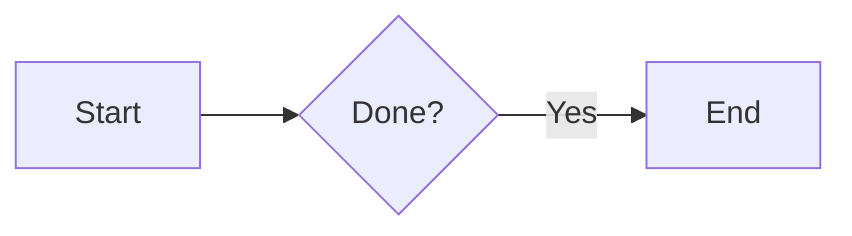

# Contributing to the docs

User-facing docs live under `docs/` and publish to [https://ageneralai.github.io/maven/](https://ageneralai.github.io/maven/) from the **`gh-pages`** branch. Merges to `main` run `mkdocs gh-deploy` in CI (`.github/workflows/ci.yml`); PRs run `mkdocs build --strict` only.

## Prerequisites

- Python 3.9+ with `pip`
- Git clone of [ageneralai/maven](https://github.com/ageneralai/maven)
- Repo root is the MkDocs project (contains `mkdocs.yml` and `docs/`)

## One-time setup

From the repository root:

```bash
pip install -r requirements-docs.txt
```

Or install the same packages directly:

```bash
pip install mkdocs mkdocs-material
```

If `docs/` already exists, do **not** run `mkdocs new .` on top of this repo — it overwrites `mkdocs.yml`. The project is already initialized.

## Preview locally

```bash
mkdocs serve
```

Open [http://127.0.0.1:8000/](http://127.0.0.1:8000/). MkDocs reloads when you edit files under `docs/` or change `mkdocs.yml`.

Build static HTML without serving:

```bash
mkdocs build
```

Output goes to `site/` (gitignored).

## Add or edit a page

1. Add or edit a Markdown file under `docs/`, e.g. `docs/my-topic.md`.
2. Register it in `mkdocs.yml` under `nav:` so it appears in the sidebar. Unlisted files still build but MkDocs warns they are missing from nav.
3. Run `mkdocs serve` and fix any broken links or nav warnings before opening a PR.

Example nav entry:

```yaml
nav:
  - Home: index.md
  - My topic: my-topic.md
```

## Mermaid diagrams

Material for MkDocs renders [Mermaid](https://mermaid.js.org/) when `mkdocs.yml` defines the `mermaid` superfences block (already configured in this repo). Use a fenced code block with language `mermaid`:

````markdown

````

Supported well with theme fonts/colors: flowchart, sequence, state, class, ER. Other types (Gantt, pie, etc.) work but may look off on mobile. See [architecture.md](architecture.md) for examples already in the docs.

## Publish to GitHub Pages

Docs deploy on every push to `main` after CI passes (`deploy-docs` job pushes built HTML to **`gh-pages`**). No manual step.

Repo setting: **Settings → Pages → Build and deployment → Source: Deploy from branch → `gh-pages` / `/ (root)`**.

Local fallback:

```bash
mkdocs gh-deploy --force
```

## What not to commit

- `site/` — build output (listed in `.gitignore`)
- Secrets or real tokens in doc examples

## Go code vs docs

| Change | Workflow |
|--------|----------|
| Markdown under `docs/` | Edit, update `nav` in `mkdocs.yml`, `mkdocs serve`, PR; merge to `main` deploys |
| Go / config / channels | `make test`, normal PR; update docs in the same PR when behavior changes |

Questions about doc structure: open an issue or PR on [ageneralai/maven](https://github.com/ageneralai/maven).
