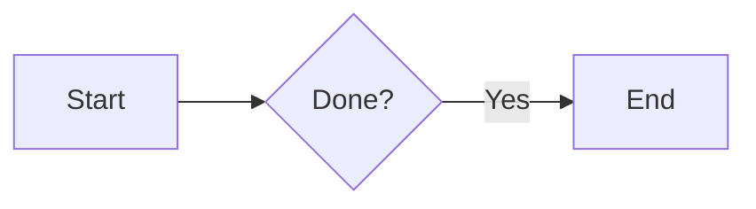

# Contributing

This page covers the contributor workflow: code, tests, and these docs. For high-level design, see [Concepts: Architecture](concepts/architecture.md).

## Project layout

```text
maven/
  cmd/maven/            # CLI entry point
  internal/
    gateway/            # Composition root (wire.go) and lifecycle
    kernel/             # Plugin-agnostic core (no plugin imports)
    plugins/            # Channel, tool, skill, voice, trigger, memory plugins
    testutil/           # Test helpers (golden files)
    version/            # Build-stamped version info
  scripts/setup.sh      # Interactive setup
  docs/                 # MkDocs source (this site)
  website/              # Marketing site assets
```

## Development standards

The full standards live in [`AGENTS.md`](https://github.com/ageneralai/maven/blob/main/AGENTS.md). Highlights:

- **Greenfield.** No legacy constraints. Delete the wrong path; write the correct one.
- **One mutation path.** `Gateway.Apply` is the only way to change active state.
- **Kernel wall.** `internal/kernel/` never imports `internal/plugins/`. Enforced by the `kernel_no_plugins` depguard rule.
- **Functional default.** Use classes only when state demands it.
- **No empty lines inside method bodies.** Keep functions compact for skimming.
- **No comments that narrate what the code does.** Only `why`, trade-offs, constraints.
- **`tsx` over `ts-node`** for any TypeScript scripts.

## Branching and commits

The repository follows a simple message format: `{top-directory} {<=7 words lowercase}`.

```text
api fix user validation logic
docs rewrite channel pages
internal/kernel rename TurnExecutor
```

One logical change per commit. No `--no-verify`. No force-push to `main`.

## Build, test, lint

```bash
make build         # binary
make test          # tests
make test-race     # race detector
make test-cover    # coverage
make lint          # golangci-lint v2
make ci            # lint + vet + race tests
```

CI runs `make ci` plus `mkdocs build --strict` on every PR.

### Golden files

Channels write outbound payloads through tested formatters; goldens live under `internal/plugins/channel/<name>/testdata/`. Update with:

```bash
UPDATE_GOLDEN=1 go test ./internal/plugins/channel/feishu/...
```

Review the diff carefully before committing.

## Adding a plugin

See [Concepts: Plugins](concepts/plugins.md). The short version:

1. Create `internal/plugins/<axis>/<name>/`.
2. Implement `plugin.Plugin` plus the axis interfaces (channel, tool, skill, …).
3. Add a config struct (and validation) under `kernel/config` if needed.
4. Add one line to `internal/gateway/wire.go`.

You will **not** edit anything under `internal/kernel/`. If you find yourself wanting to, stop and design a kernel interface change first.

## Working on docs

Docs live under `docs/`. The site is MkDocs Material; the nav is in `mkdocs.yml`.

### Local preview

```bash
pip install -r requirements-docs.txt
mkdocs serve
```

Open <http://127.0.0.1:8000>. Changes to `docs/` or `mkdocs.yml` hot reload.

### Build (without serving)

```bash
mkdocs build           # → site/ (gitignored)
mkdocs build --strict  # fail on broken links / nav warnings
```

CI runs `mkdocs build --strict` on every PR. Fix link errors before opening a PR.

### Style

- **Plain English.** Terse, technical, no marketing.
- **Use tables for option lists.** Default value + description columns.
- **Use Mermaid for flows.** `flowchart`, `sequenceDiagram`, `stateDiagram` render natively.
- **Backtick file/dir/identifier names** (`internal/kernel/pipeline`, `Gateway.Apply`).
- **Don't apologize.** Don't pad. State the fact.
- **Cross-link.** Use relative links between docs (`[…](../concepts/sessions.md)`).

### Adding a page

1. Add the markdown under `docs/<section>/<page>.md`.
2. Register it in `mkdocs.yml` under `nav:`.
3. `mkdocs serve` and verify it appears in the sidebar.

Unlisted files build but trigger warnings.

### Mermaid

````markdown

````

Supported diagram types: `flowchart`, `sequenceDiagram`, `stateDiagram`, `classDiagram`, `erDiagram`. The Material theme styles them; check mobile rendering for wide flowcharts.

### What not to commit

- `site/` (build output, gitignored).
- Secrets or real tokens in examples — use `…`, `sk-ant-…`, `placeholder`.

## Deploying docs

Pushes to `main` deploy via CI:

- PRs run `mkdocs build --strict`.
- Merges trigger `mkdocs gh-deploy` on the `gh-pages` branch (`.github/workflows/ci.yml`).

GitHub Pages serves `gh-pages` (repo **Settings → Pages → Source: Deploy from branch → `gh-pages` / `/`**).

Manual fallback (rarely needed):

```bash
mkdocs gh-deploy --force
```

## Questions

Open an issue on [ageneralai/maven](https://github.com/ageneralai/maven/issues) or start a discussion. For sensitive reports (security), email the maintainers listed in the repository.
