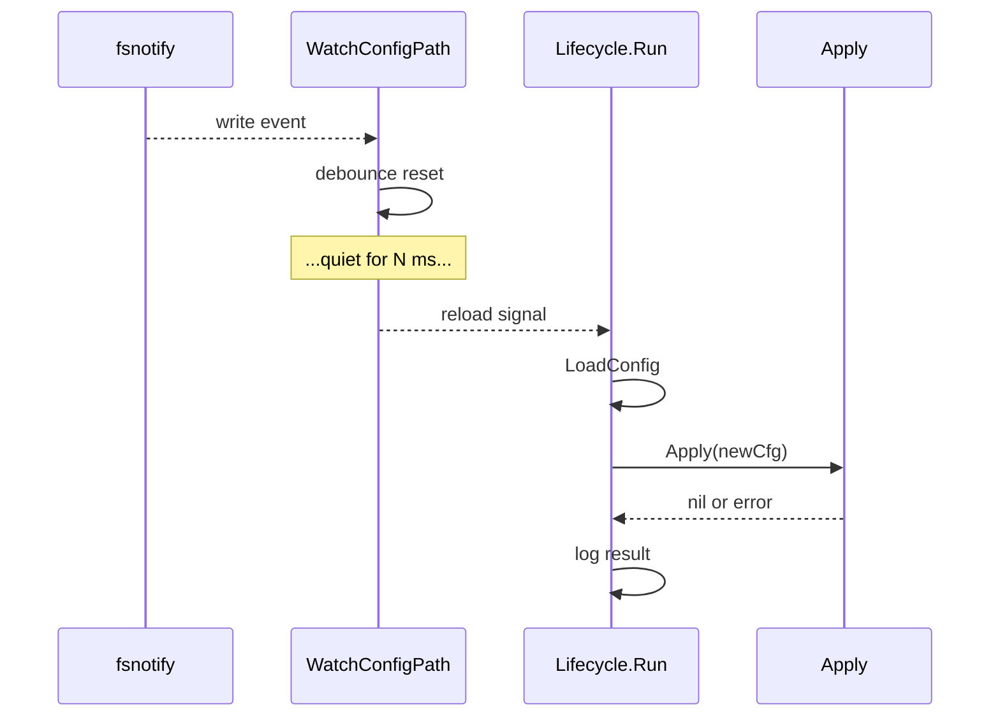

# Hot reload

The gateway can watch `~/.maven/config.json` and re-apply changes without restarting the process. Useful for tweaking models, toggling channels, editing skills, or rotating tokens.

## Enable

```json
{
  "gateway": {
    "hotReload": true,
    "reloadDebounceMs": 800
  }
}
```

| Field | Default | Description |
|-------|---------|-------------|
| `gateway.hotReload` | `false` | Master toggle. |
| `gateway.reloadDebounceMs` | `800` (when omitted or `0`) | Debounce in milliseconds. Filesystems often emit multiple events for one save; the debounce coalesces them. |

## What gets reloaded

Hot reload re-runs `Gateway.Apply`, which:

- Re-loads skills from disk.
- Rebuilds the system prompt (re-reads `AGENTS.md`, `SOUL.md`, `MEMORY.md`).
- Re-registers slash commands (built-ins + plugins).
- Builds a fresh agent runtime via the factory.
- Re-applies channels (`ChannelManager.Apply`): stops removed/changed channels, starts new ones.
- Restarts background triggers (cron, heartbeat, mem-consolidate).
- Updates log verbosity from `logging.level` (and `MAVEN_LOG_LEVEL` when set at load time).

The pipeline runtime swap happens under the write lock; in-flight chat turns drain first.

## What does **not** reload

| Field | Why |
|-------|-----|
| `agent.workspace` | Workspace directory is captured by router, history store, channel root paths. Changing it requires a restart — `Apply` rejects the reload with `reload: agent.workspace change not supported`. |
| `gateway.host` / `gateway.port` | The HTTP listener is bound at startup. |
| `gateway.cron.maxConcurrentRuns` | Applied to the cron admission lane at gateway start; not propagated by `Apply`. Restart to change. |

## Watch mechanics

`internal/kernel/config.WatchConfigPath` watches the **parent directory** with `fsnotify`, not the file itself. This handles atomic-save patterns (write temp → rename) common in editors.

Events that schedule a reload:

- `Write`, `Create`, `Rename`, `Remove` on the config file's basename.

The debounce timer resets on each new event. The reload fires after `reloadDebounceMs` of quiet.

## Lifecycle



A failed reload (e.g. invalid JSON, validation error, workspace change attempted) logs the error and keeps the previous config running. The watcher continues — fix the file and save again.

## Production caveat

In Docker, mount the config in a way that supports `fsnotify`. Mounting a single file from the host through Docker Desktop's filesystem layer can swallow events; mount the directory (`/root/.maven/`) instead, or use a volume.

## Log line

A successful reload logs:

```text
INFO gateway reloaded host=0.0.0.0 port=18790 channels=[telegram web]
```

Errors log at `error`:

```text
ERROR gateway reload load config error err="parse config: invalid character …"
ERROR gateway reload apply error err="reload: agent.workspace change not supported"
```
