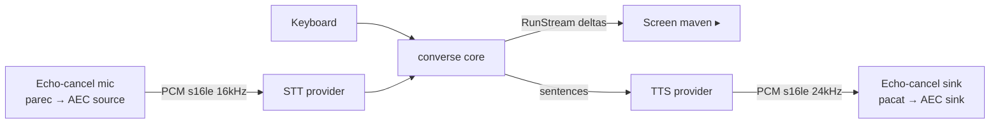

# Voice

Maven speaks and listens through a single, transport-agnostic conversation core (`internal/kernel/converse`). The core deals only in **text turns**; microphones, speakers, terminals, and browsers are pluggable modalities behind two one-method ports:

- `Source` — produces user text (keyboard, or mic → STT).
- `Sink` — renders an assistant reply stream (screen, or TTS → speaker).

Speech-to-text and text-to-speech are just codecs at the edge; the core knows nothing about audio. Two transports use it today: the **Web UI** (browser mic/speaker) and the **CLI REPL** (local or Android mic/speaker).

## CLI REPL (and Android)

`maven agent --voice` runs a multimodal REPL: you can type **and** speak at the same time, and replies are simultaneously printed to the terminal and spoken aloud. Typed and spoken turns share one `cli` session, so the conversation is continuous regardless of modality. Speaking or typing again mid-reply **preempts** the in-flight turn (barge-in) — always on, no toggle.

**PulseAudio is the default backend** for CLI voice. With `speech.echoCancel: "pulse"` (default) Maven loads `module-echo-cancel` on startup — trying `aec_method=webrtc` (the same WebRTC algorithm browsers use), then `speex` — and routes capture/playback through dedicated echo-cancelled devices (`maven_echocancel_source` / `maven_echocancel_sink`), so the mic no longer picks up the agent's TTS and barge-in works without feedback loops. Maven distinguishes two failures: PulseAudio unreachable (`pulseaudio unavailable`) vs the module failing to initialize (`echo-cancel module unavailable`). There is no silent fallback — it exits with the exact PulseAudio diagnostic.

Install PulseAudio on your platform.

### Android / Termux

Termux's PulseAudio ships `module-echo-cancel.so` **without** a working AEC backend — every `aec_method` (including `speex`) fails `Module initialization failed`. Set `speech.echoCancel: "off"` to skip the module entirely and run capture/playback verbatim:

```json
{ "speech": { "echoCancel": "off" } }
```

`off` only disables echo cancellation. Voice still needs a **real Android mic/speaker exposed to your capture/playback commands** — stock Termux PulseAudio shows only `auto_null` (a null sink), so default `parec`/`pacat` capture silence. Provide working commands via `speech.capture` / `speech.playback` (e.g. a Termux-API based PCM streamer) or load a real audio module before starting. Without echo cancellation, use headphones; otherwise TTS leaks into the mic and triggers false barge-in.

The CLI REPL uses one transcript shape (keyboard-only or `--voice`): after each `maven ▸` reply, the next line is `you ▸` (type on it or speak to populate via STT). Empty Enter does not add another prompt.



Audio device I/O is delegated to external processes that stream **raw PCM** over stdout/stdin — no CGO, no ALSA/PulseAudio linkage in the binary. The same binary therefore runs unchanged on a Linux desktop and on Android; only the configured commands differ.

| Direction | Format | Default command |
|-----------|--------|-----------------|
| Mic → STT | PCM s16le, 16 kHz, mono | `parec --format=s16le --rate=16000 --channels=1 --latency-msec=50 --device=maven_echocancel_source` |
| TTS → Speaker | PCM s16le, 24 kHz, mono | `pacat --format=s16le --rate=24000 --channels=1 --latency-msec=100 --device=maven_echocancel_sink` |

The low `--latency-msec` values are deliberate: small mic fragments let the VAD detect speech onset within ~50 ms, and a bounded playback buffer means killing `pacat` on barge-in silences the speaker near-instantly (matching the browser's queue flush). Without them, PulseAudio's default buffering delays both onset detection and the barge-in cut.

Echo cancellation is selected by `speech.echoCancel`. Default `pulse` loads `module-echo-cancel` (webrtc, then speex) under internal device names, routes capture/playback through it so the agent never hears itself, and unloads it on exit. `off` skips PulseAudio management and runs `speech.capture` / `speech.playback` (command + args) verbatim with no forced device — for Android/Termux and environments without a working AEC backend. PulseAudio provides `parec`, `pacat`, and `pactl`.

```json
{
  "speech": {
    "sttProvider": "deepgram",
    "ttsProvider": "openai",
    "capture":  { "command": "parec", "args": ["--format=s16le", "--rate=16000", "--channels=1", "--latency-msec=50"] },
    "playback": { "command": "pacat", "args": ["--format=s16le", "--rate=24000", "--channels=1", "--latency-msec=100"] }
  }
}
```

STT/TTS providers and credentials are identical to the Web UI (see below). The CLI builds its own minimal voice provider registry; no gateway or channels are required.

## Web UI

The Web UI ships an optional voice mode: microphone capture in the browser → STT → agent → TTS → playback. Maven owns the realtime contract; provider plugins handle the actual STT and TTS.

## Wire diagram


The same WebSocket carries upstream microphone PCM and downstream synthesized PCM. A single-byte `0x00` sentinel from server → client flushes the audio queue (used when the client starts speaking again).

## Enable

```json
{
  "channels": {
    "web": {
      "enabled": true,
      "voice": {
        "enabled": true
      }
    }
  },
  "speech": {
    "sttProvider": "deepgram",
    "ttsProvider": "openai"
  }
}
```

| Field | Default | Description |
|-------|---------|-------------|
| `channels.web.enabled` | `false` | Master Web UI toggle. |
| `channels.web.voice.enabled` | `false` | Browser voice transport. Requires Web UI enabled. |
| `speech.sttProvider` | `deepgram` | Speech-to-text provider. Only Deepgram is implemented. |
| `speech.ttsProvider` | `openai` | Text-to-speech provider. `openai` / `deepgram` / `elevenlabs` / `cartesia`. |

## Audio contracts

Both directions use **raw PCM, signed 16-bit little-endian**.

| Direction | Sample rate | Channels | Format |
|-----------|-------------|----------|--------|
| Browser → server (mic) | 16 kHz | mono | Linear PCM (downsampled by `audio-worklet-processor.js`). |
| Server → browser (TTS) | 24 kHz | mono | Raw PCM — no WAV/MP3 container. The client builds `AudioBuffer` from each chunk directly. |

Configure providers accordingly:

- Deepgram TTS: `container=none`, `encoding=linear16`, `sample_rate=24000`.
- ElevenLabs: `output_format=pcm_24000`.
- Cartesia: `container=raw`, `encoding=pcm_s16le`, `sample_rate=24000`.
- OpenAI TTS: `response_format=pcm`.

Headered formats will fail silently at the start of each utterance (the client treats the header bytes as samples).

## Credentials

All voice credentials come from environment variables (`kernel/voice.MergeKeys`):

| Provider | Env (or fallback) | Required extra |
|----------|-------------------|----------------|
| Deepgram | `MAVEN_DEEPGRAM_API_KEY`, then `DEEPGRAM_API_KEY` | — |
| OpenAI TTS | `OPENAI_API_KEY`, then `MAVEN_OPENAI_API_KEY`, then `provider.apiKey` (for OpenAI-type providers) | — |
| ElevenLabs | `MAVEN_ELEVENLABS_API_KEY`, then `ELEVENLABS_API_KEY` | `ELEVENLABS_VOICE_ID` |
| Cartesia | `MAVEN_CARTESIA_API_KEY`, then `CARTESIA_API_KEY` | `CARTESIA_VOICE_ID` |

Per-provider HTTPS proxies and Cartesia model/version overrides live under `speech.<provider>` in config; see [Reference: Configuration](../reference/configuration.md).

## Session model

The browser generates a UUID at page load and includes it as `?session=<uuid>` when dialing `/ws/voice`. The voice transport resolves that into a Maven session via `wsession.ResolveMavenSessionID`. Voice turns share session history with the Web UI text chat.

## Voice activity detection

A simple RMS threshold on the inbound PCM triggers barge-in: in-flight TTS aborts, the browser drops its playback queue, and the new transcript starts a fresh agent turn.

## Sentence segmentation

Streamed model output is buffered into a `kernel/voice` segmenter that takes complete sentences (ending in `.`, `!`, `?` before whitespace) up to a maximum of 800 runes. Each sentence becomes a TTS request. This trades a small first-utterance latency for fewer TTS round-trips and natural prosody.

## Provider files

| Plugin | Implements |
|--------|------------|
| `internal/plugins/voice/deepgram` | STT (live WebSocket) + TTS (HTTP streaming). |
| `internal/plugins/voice/openai` | TTS only. |
| `internal/plugins/voice/elevenlabs` | TTS only. Requires `ELEVENLABS_VOICE_ID`. |
| `internal/plugins/voice/cartesia` | TTS only. Requires `CARTESIA_VOICE_ID`. |

## Failure modes

- Missing credentials at startup → provider registration returns nil → factory error at first use ("openai api key is empty"). The Web UI voice button still appears but the WebSocket closes immediately.
- Browser without `AudioWorklet` support (very old browsers) → graceful failure, logged in console.
- Network drop during TTS → partial audio plays; the next sentence retries the HTTP call.

## Disable

Set `channels.web.voice.enabled = false`. The mic button stays hidden and `/ws/voice` is unregistered.
