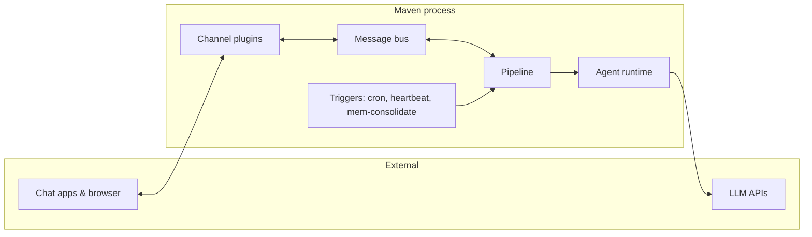

---
hide:
  - navigation
---

# Maven

A personal AI assistant. One Go binary that runs locally or in a container, talks to your favorite chat apps, schedules its own work, and delegates coding tasks to external agents.

  

Built on [ageneral-agents-go](https://github.com/ageneralai/ageneral-agents-go).

## What Maven does

- **Chat in your apps.** Inbound messages from Telegram, Feishu (Lark), WeCom, Matrix, WhatsApp, and the built-in Web UI all flow through the same agent runtime.
- **Run on a schedule.** Persistent cron jobs and a periodic heartbeat call the same execution path the chat surfaces use.
- **Speak and listen.** The Web UI supports realtime browser voice via Deepgram STT and OpenAI/Deepgram/ElevenLabs/Cartesia TTS.
- **Delegate work.** A `Task` tool runs in-process subagents (explore, plan, general-purpose). A `DelegateTask` tool launches external [ACP](https://agentclientprotocol.com) coding agents (Claude Code, Gemini CLI, etc.) as subprocesses.
- **Remember.** A primary-only memory plugin curates `MEMORY.md`; the agent appends to daily journals with `remember`, searches them with `memory_search`, and a background pass consolidates worth-keeping facts.
- **Stay private.** All outbound HTTP respects `HTTPS_PROXY`, `SSL_CERT_FILE`, and `NO_PROXY`, so you can route everything through a vault like [OneCLI](deployment/onecli.md).

## Architecture at a glance

One execution surface for chat, cron, heartbeat, and consolidation. One declarative `Apply` loop reconciles config into running state. Read [Concepts: Architecture](concepts/architecture.md) for the details.

## Documentation map

- :material-rocket-launch: **[Get started](getting-started.md)**

    Install, configure, and run Maven for the first time.

- :material-puzzle: **[Concepts](concepts/architecture.md)**

    Architecture, pipeline, plugins, sessions, streaming.

- :material-book-open-page-variant: **[Guides](guides/workspace.md)**

    Workspace, memory, skills, slash commands, cron, voice, subagents.

- :material-message: **[Channels](channels/index.md)**

    Telegram, Feishu, WeCom, Matrix, WhatsApp, Web UI.

- :material-server: **[Deployment](deployment/docker.md)**

    Docker, proxy, OneCLI vault.

- :material-file-tree: **[Reference](reference/configuration.md)**

    Configuration schema, CLI commands, environment, HTTP API.

## License

[MIT](https://github.com/ageneralai/maven/blob/main/LICENSE).
